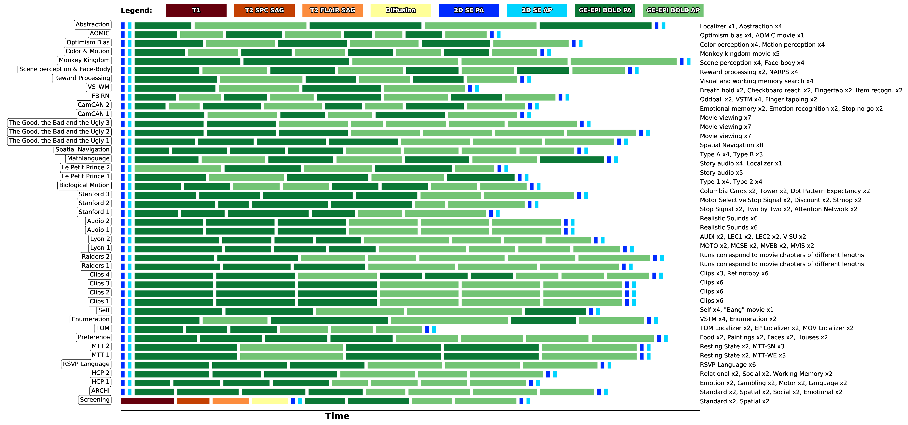

MRI acquisitions
================

This section contains details about the overall organization of the MRI
sessions across participants. It provides details about session IDs for
every participant, the MRI sequences employed in every session and their
imaging parameters. A description about data anomalies is also provided
per participant for every session.

For more information about the technical specifications of the MRI
equipment used, please consult Section "MRI Equipment" of `Pinho et al.
2018 <https://doi.org/10.1038/sdata.2018.105>`__ or `Pinho et al. 2020 <https://doi.org/10.1038/s41597-020-00670-4>`__.

Organization of the MRI sessions
--------------------------------

The figure below depicts the temporal organization of
runs in terms of MRI sequences within sessions:

.. _acqdiagram:

   **Structure of the IBC-MRI sessions in terms of number, type and duration of the runs performed.** Each 
   rectangle represents one run; its width visually quantifies the duration of that run 
   and the color indicates the type of sequence employed. Rows of rectangles 
   depict the chronological organization of every session. Labels on 
   the left side identify the session represented by each row. For every 
   session, the tasks employed during the EPI sequences are specified on 
   the right side of the corresponding row.

Besides, a plan of the MRI sessions undertaken per participant can be
found in Table `[table:acqplan_appendix] <#table:acqplan_appendix>`__.
and a summary of the fMRI-data anomalies over sessions and participants
can be found in Table `[table:dataanomalies_appendix] <#table:dataanomalies_appendix>`__.

Parameters of the MRI sequences
-------------------------------

Details of the parameters used for all the MRI sequences employed are
provided over the following subsections. The bulk of the data is
collected using a SIEMENS MAGNETOM Prisma-fit 3T scanner.

2D Spin-Echo
~~~~~~~~~~~~

The 2D Spin-Echo maps are used to obtain a model of distortions for EPI
images: 2 pairs of AP/PA images are acquired along with each EPI (BOLD
or diffusion-weighted) acquisition one at the start and one at the end
of each scanner session.

.. _spinecho:

.. table:: Acquisition parameters for Spin-Echo.

   ======================= =============
   Parameter               Value
   ======================= =============
   *Sequence*              Spin Echo EPI
   *TR*                    7680 ms
   *TE*                    46 ms
   *FOV*                   192 mm
   *Matrix*                128 x 128
   *Slice thickness*       1.50 mm
   *Number of slices*      93
   *GRAPPA iPAT*           2
   *Ref. lines PE*         62
   *Echo spacing*          0.65 ms
   *BW*                    1776 Hz/Px
   *Fat suppr.*            Fat sat.
   *Phase partial Fourier* None
   *Multi-slice mode*      Interleaved
   *Series*                Interleaved
   ======================= =============

EPI T2\* with BOLD contrast for task scans
~~~~~~~~~~~~~~~~~~~~~~~~~~~~~~~~~~~~~~~~~~

The same acquisition parameters were used in all task-fMRI runs, only
the number of repetitions (TRs) changed as each run had a different
duration, `This table <TRnum_>`__ contains the number of TRs for
every task.

.. _bold:

.. table:: Acquisition parameters for task-based BOLD-contrast images.

   ========================= =================
   Parameter                 Value
   ========================= =================
   *Sequence*                Gradient Echo EPI
   *TR*                      2000 ms
   *TE*                      26.8 ms
   *Flip angle*              74 deg
   *Fat suppr.*              Fat sat.
   *FOV*                     192 mm
   *Matrix*                  128 x 128
   *Slice thickness*         1.50 mm
   *Number of slices*        93 slices
   *GRAPPA iPAT*             2
   *Multiband accel. factor* 3
   *Echo spacing*            0.65 ms
   *BW*                      1776 Hz/Px
   *Phase partial Fourier*   None
   *Multi-slice mode*        Interleaved
   *Series*                  Interleaved
   ========================= =================

The only exception to these parameters specifications was the :ref:`Multi-modal` task, `this table <multimodalparam_>`__ contains the details of the parameters that were changed.

.. _multimodalparam:

.. table:: Acquisition parameters for :ref:`Multi-modal` tasks' BOLD-contrast images.

   ========================= =================
   Parameter                 Value
   ========================= =================
   *Sequence*                Gradient Echo EPI
   *TR*                      2600 ms
   *TE*                      26.8 ms
   *Flip angle*              78 deg
   *Fat suppr.*              Fat sat.
   *FOV*                     192 mm
   *Matrix*                  128 x 128
   *Slice thickness*         2 mm
   *Number of slices*        75 slices
   *GRAPPA iPAT*             2
   *Multiband accel. factor* 3
   *Echo spacing*            0.65 ms
   *BW*                      1776 Hz/Px
   *Phase partial Fourier*   None
   *Multi-slice mode*        Interleaved
   *Series*                  Interleaved
   ========================= =================

EPI T2\* with BOLD contrast for resting state scans
~~~~~~~~~~~~~~~~~~~~~~~~~~~~~~~~~~~~~~~~~~~~~~~~~~~

.. _resting:

.. table:: Acquisition parameters for resting-state BOLD-contrast images.

   ========================= =================
   Parameter                 Value
   ========================= =================
   *Sequence*                Gradient Echo EPI
   *TR*                      760 ms
   *TE*                      29 ms
   *Number of TRs*           1120
   *Flip angle*              53 deg
   *Fat suppr.*              Fat sat.
   *FOV*                     194 mm
   *Matrix*                  88 x 88
   *Slice thickness*         2.20 mm
   *Number of slices*        66 slices
   *Multiband accel. factor* 6
   *Echo spacing*            0.55 ms
   *BW*                      2470 Hz/Px
   *Phase partial Fourier*   None
   *Multi-slice mode*        Interleaved
   *Series*                  Interleaved
   ========================= =================

Diffusion
~~~~~~~~~

Three types of diffusion sequences were employed in three different
sessions, respectively:

-  High-resolution (1.3mm isotropic, 60 directions) acquisitions with
   :math:`B=1500` or :math:`B=3000`.

.. _higresdiff:

.. table:: Acquisition parameters for high-resolution diffusion imaging.

   ========================= ===========================
   Parameter                 Value
   ========================= ===========================
   *Sequence*                diff_dw60_TE76
   *TR*                      7000 ms
   *TE*                      76 ms
   *Flip angle*              90 deg
   *Refocusing flip angle*   180 deg
   *FOV*                     240 mm
   *Slice thickness*         1.30 mm
   *Number of slices*        112 slices
   *GRAPPA iPAT*             2
   *Multiband accel. factor* 2
   *Echo spacing*            0.71 ms
   *BW*                      1598 Hz/Px
   *Phase partial Fourier*   6/8
   *b-values*                [1500, 3000] s/mm\ :sup:`2`
   ========================= ===========================

-  Multi-shell (1.3mm isotropic, 20 directions) acquisitions for
   multiple B-values ranging from 300 to 3000 in steps of 300.

.. _multishelldiff:

.. table:: Acquisition parameters for multi-shell diffusion imaging.

   ========================= ============================================
   Parameter                 Value
   ========================= ============================================
   *Sequence*                diff_dw26_TE76
   *TR*                      7000 ms
   *TE*                      76 ms
   *Flip angle*              90 deg
   *Refocusing flip angle*   180 deg
   *FOV*                     240 x 240 mm
   *Matrix*                  128 x 128
   *Slice thickness*         1.30 mm, 112 slices, 1.30 mm isotropic
   *Multiband accel. factor* 2
   *Echo spacing*            0.71 ms
   *BW*                      1598 Hz/Px
   *Phase partial Fourier*   6/8
   *b-values*                [0, 300, 600, 900, 1200, 1500,
   \                         1800, 2100, 1400, 2700, 3000] s/mm\ :sup:`2`
   ========================= ============================================

-  Two low-resolution acquisitions (2mm, 20 directions) used for screening.

.. _screeningdiff:

.. table:: Acquisition parameters for screening.

   ========================= =========================
   Parameter                 Value
   ========================= =========================
   *Sequence*                diff_screening_2mmiso
   *TR*                      9000 ms
   *TE*                      66,00 ms
   *Flip angle*              90 deg
   *Refocusing flip angle*   180 deg
   *FOV*                     240 x 240 mm
   *Matrix*                  128 x 128
   *Slice thickness*         2 mm isotropic, 70 slices
   *Multiband accel. factor* 1
   *Echo spacing*            0,54 ms
   *BW*                      2192 Hz/Px
   *Phase partial Fourier*   6/8
   *b-values*                0, 1500 s/mm\ :sup:`2`
   ========================= =========================

.. table::

   ========================= ===========================
   Parameter                 Value
   ========================= ===========================
   *Sequence*                diff_dw20_MB
   *TR*                      5700 ms
   *TE*                      79,40 ms
   *Flip angle*              90 deg
   *Refocusing flip angle*   180 deg
   *FOV*                     240 x 240 mm
   *Matrix*                  160 x 160
   *Slice thickness*         1,5 mm isotropic, 94 slices
   *Multiband accel. factor* 2
   *Echo spacing*            0,65 ms
   *BW*                      1838 Hz/Px
   *Phase partial Fourier*   6/8
   *b-values*                0, 1500 s/mm\ :sup:`2`
   ========================= ===========================

T1
~~

A few types of T1 images were acquired:

-  High-resolution T1 MPRAGE anatomical scan acquired during screening

.. _mpragesagT1:

.. table:: Acquisition parameters for high-resolution T1 MPRAGE scan.

   ========================= ===========
   Parameter                 Value
   ========================= ===========
   *Sequence*                T1 MPRAGE
   *Orientation*             Sagittal
   *TA*                      7:46
   *TR*                      2300 ms
   *TE*                      2.98 ms
   *TI*                      900 ms
   *Flip angle*              9 deg
   *FOV*                     256 mm
   *Matrix*                  256 x 256
   *Slice thickness*         1 mm
   *Number of slices*        160
   *Multiband accel. factor* 1
   *Echo spacing*            7.1 ms
   *BW*                      240 Hz/Px
   *Fat suppr.*              None
   *Phase partial Fourier*   7/8
   *Turbo factor*            176
   *Series*                  Interleaved
   ========================= ===========

-  Yearly maintenance T1 MPRAGE anatomical scan

.. _highresT1:

.. table:: Acquisition parameters for yearly maintenance T1 MPRAGE scan.

   ========================= ===========
   Parameter                 Value
   ========================= ===========
   *Sequence*                T1 MPRAGE
   *Orientation*             Sagittal
   *TA*                      4:44
   *TR*                      2300 ms
   *TE*                      3.05 ms
   *TI*                      900 ms
   *Flip angle*              9 deg
   *FOV*                     230 mm
   *Matrix*                  256 x 256
   *Slice thickness*         0.9 mm
   *Number of slices*        176
   *Multiband accel. factor* 2
   *Echo spacing*            7.4 ms
   *BW*                      240 Hz/Px
   *Fat suppr.*              None
   *Phase partial Fourier*   7/8
   *Turbo factor*            176
   *Series*                  Interleaved
   ========================= ===========

-  High-resolution T1 MPRAGE anatomical scan acquired with diffusion tractography

.. _mpragesagT1diff:

.. table:: Acquisition parameters for high-resolution T1 MPRAGE scan.

   ======================= ===========
   Parameter               Value
   ======================= ===========
   *Sequence*              T1 MPRAGE
   *Orientation*           Sagittal
   *TA*                    18:26
   *TR*                    2300 ms
   *TE*                    4.93 ms
   *TI*                    900 ms
   *Flip angle*            9 deg
   *FOV*                   248 mm
   *Matrix*                352 x 352
   *Slice thickness*       0.7 mm
   *Number of slices*      160
   *GRAPPA accel. factor*  3
   *Ref. lines PE*         61
   *Echo spacing*          11.5 ms
   *BW*                    130 Hz/Px
   *Fat suppr.*            None
   *Phase partial Fourier* Deactivated
   *Turbo factor*          339
   *Series*                Interleaved
   ======================= ===========

T2
~~

Several types of images were acquired under this category:

-  High-resolution T2 turbo SE sequence (Siemens SPACE)

.. _spcsagT2:

.. table:: Acquisition parameters for high-resolution T2 sagittal images.

   ========================= ===========
   Parameter                 Value
   ========================= ===========
   *Sequence*                T2 turbo SE
   *Orientation*             Sagittal
   *TA*                      15:30
   *TR*                      3200 ms
   *TE*                      420 ms
   *Flip angle mode*         T2 var
   *Turbo factor*            284
   *FOV*                     270 mm
   *Matrix*                  384 x 384
   *Slice thickness*         0.70 mm
   *Number of slices*        240 slices
   *Multiband accel. factor* 1
   *Echo spacing*            3.68 ms
   *BW*                      723 Hz/Px
   *Fat suppr.*              None
   *Phase partial Fourier*   None
   *Series*                  Interleaved
   ========================= ===========

-  T2 FLAIR sagittal.

.. _flairsagT2:

.. table:: Acquisition parameters for T2 FLAIR sagittal images.

   ========================= ======================================
   Parameter                 Value
   ========================= ======================================
   *Sequence*                T2_FLAIR_SAG_FOV230
   *TR*                      5000 ms
   *TE*                      396 ms
   *Flip angle mode*         T2 var
   *FOV*                     230 x 230 mm
   *Matrix*                  256 x 256
   *Slice thickness*         0.81 mm, 192 slices, 0.81 mm isotropic
   *Multiband accel. factor* 1
   *Echo spacing*            3,36 ms
   *BW*                      781 Hz/Px
   *Phase partial Fourier*   0
   *b-values*                0 s/mm\ :sup:`2`
   ========================= ======================================

-  T2 sagittal with fat saturation.

.. _sagfatsatT2:

.. table:: Acquisition parameters for T2 images with Fat-Sat.

   ======================= ======================================
   Parameter               Value
   ======================= ======================================
   *Sequence*              T2_SPC_SAG_fatsat
   *TR*                    3200 ms
   *TE*                    420 ms
   *Flip angle mode*       T2 var
   *FOV*                   270 x 270 mm
   *Matrix*                384 x 384
   *Slice thickness*       0.70 mm, 240 slices, 0.70 mm isotropic
   *Echo spacing*          3.68 ms
   *BW*                    723 Hz/Px
   *Phase partial Fourier* None
   *b-values*              0 s/mm\ :sup:`2`
   ======================= ======================================

-  T2 sagittal (0.7mm).

.. _highres-sag_T2:

.. table:: Acquisition parameters for high-resolution sagittal T2 images.

   ========================= ======================================
   Parameter                 Value
   ========================= ======================================
   *Sequence*                T2_SPC_SAG_0.7mm
   *TR*                      3200 ms
   *TE*                      420 ms
   *Flip angle mode*         T2 var
   *FOV*                     270 x 270 mm
   *Matrix*                  384 x 384
   *Slice thickness*         0.70 mm, 240 slices, 0.70 mm isotropic
   *Multiband accel. factor* 1
   *Echo spacing*            3.68 ms
   *BW*                      723 Hz/Px
   *Phase partial Fourier*   None
   *b-values*                0 s/mm\ :sup:`2`
   ========================= ======================================

T1 relaxometry
~~~~~~~~~~~~~~

Three different runs were performed:

-  A B1 map for T1 mapping.

.. _b1T1:

.. table:: Acquisition parameters for B1 maps.

   ========================= ===============================
   Parameter                 Value
   ========================= ===============================
   *Sequence*                B1Map_for_T1_map
   *TR*                      20000 ms
   *TE*                      2.59 ms
   *Flip angle*              8 deg
   *FOV*                     256 x 256 mm
   *Matrix*                  128 x 128
   *Slice thickness*         2 mm, 44 slices, 2 mm isotropic
   *Multiband accel. factor* 1
   *Echo spacing*            4.5 ms
   *BW*                      800 Hz/Px
   *Phase partial Fourier*   None
   *b-values*                0 s/mm\ :sup:`2`
   ========================= ===============================

-  T1 maps with FA from 3 to 19 in steps of two.

.. _faT1:

.. table:: Acquisition parameters for T1 maps.

   ========================= ================================
   Parameter                 Value
   ========================= ================================
   *Sequence*                T1Map_1mm
   *TR*                      10 ms
   *TE*                      3 ms
   *Flip angle*              3 deg
   *FOV*                     256 x 256 mm
   *Matrix*                  128 x 128
   *Slice thickness*         1 mm, 176 slices, 1 mm isotropic
   *Multiband accel. factor* 1
   *BW*                      240 Hz/Px
   *Phase partial Fourier*   7/8
   *b-values*                0 s/mm\ :sup:`2`
   ========================= ================================

T2 relaxometry
~~~~~~~~~~~~~~

Two types of relaxometry images were acquired:

-  T2\* sagittal (relaxometry).

.. _sagT2relaxo:

.. table:: Acquisition parameters for T2 relaxometry images.

   ========================= ======================================
   Parameter                 Value
   ========================= ======================================
   *Sequence*                relaxometry_T2star_sag
   *TR*                      50 ms
   *TE1*                     1.77 ms
   *TE2*                     5.06 ms
   *TE3*                     8.35 ms
   *TE4*                     11.64 ms
   *TE5*                     14.93 ms
   *TE6*                     18.22 ms
   *TE7*                     21.51 ms
   *TE8*                     24.80 ms
   *TE9*                     28.09 ms
   *TE10*                    32.50 ms
   *TE11*                    38.90 ms
   *TE12*                    47.00 ms
   *Flip angle*              20 deg
   *FOV*                     288 x 288 mm
   *Matrix*                  196 x 196
   *Slice thickness*         1.50 mm, 120 slices, 1.50 mm isotropic
   *Multiband accel. factor* 1
   *BW*                      420 Hz/Px
   *Phase partial Fourier*   7/8
   *b-values*                0 s/mm\ :sup:`2`
   ========================= ======================================

-  T2 relaxometry with 12 contrasts.

.. _12conT2relaxo:

.. table:: Acquisition parameters for 12-contrast T2 images.

   ======================= ====================================
   Parameter               Value
   ======================= ====================================
   *Sequence*              relaxometry_T2_tra_12contrastes
   *TR*                    7600 ms
   *TE1*                   14 ms
   *Flip angle*            180 deg
   *FOV*                   256 x 256 mm
   *Matrix*                256 x 256
   *Slice thickness*       1,1 mm, 128 slices, 1,1 mm isotropic
   *GRAPPA accel. factor*  3
   *Echo spacing*          14 ms
   *BW*                    215 Hz/Px
   *Phase partial Fourier* None
   *b-values*              0 s/mm\ :sup:`2`
   ======================= ====================================

Number of TRs for each task
~~~~~~~~~~~~~~~~~~~~~~~~~~~

.. _TRnum:

.. table:: Number of repetitions for each task; TR = 2s.

   +-------------------------+-------------------------+---------------+
   | Task                    | Runs                    | Number of TRs |
   +=========================+=========================+===============+
   | *ARCHI Standard*        | all runs                | 156           |
   +-------------------------+-------------------------+---------------+
   | *ARCHI Spatial*         | all runs                | 252           |
   +-------------------------+-------------------------+---------------+
   | *ARCHI Social*          | all runs                | 262           |
   +-------------------------+-------------------------+---------------+
   | *ARCHI Emotional*       | all runs                | 220           |
   +-------------------------+-------------------------+---------------+
   | *HCP Language*          | all runs                | 229           |
   +-------------------------+-------------------------+---------------+
   | *HCP Emotion*           | all runs                | 139           |
   +-------------------------+-------------------------+---------------+
   | *HCP Gambling*          | all runs                | 188           |
   +-------------------------+-------------------------+---------------+
   | *HCP Motor*             | all runs                | 185           |
   +-------------------------+-------------------------+---------------+
   | *HCP Social*            | all runs                | 196           |
   +-------------------------+-------------------------+---------------+
   | *HCP Relational*        | all runs                | 311           |
   +-------------------------+-------------------------+---------------+
   | *HCP WM*                | all runs                | 303           |
   +-------------------------+-------------------------+---------------+
   | *RSVP Language*         | all runs                | 310           |
   +-------------------------+-------------------------+---------------+
   | *Mental Time Travel*    | all runs                | 394           |
   +-------------------------+-------------------------+---------------+
   | *Preference*            | all runs                | 248           |
   +-------------------------+-------------------------+---------------+
   | *Theory-of-Mind         | all runs                | 186           |
   | localizer*              |                         |               |
   +-------------------------+-------------------------+---------------+
   | *Theory-of-Mind and*    |                         |               |
   +-------------------------+-------------------------+---------------+
   | *Pain-Matrix Narrative  |                         |               |
   | localizer*              |                         |               |
   +-------------------------+-------------------------+---------------+
   | *Theory-of-Mind and*    |                         |               |
   +-------------------------+-------------------------+---------------+
   | *Pain-Matrix Movie      |                         |               |
   | localizer*              |                         |               |
   +-------------------------+-------------------------+---------------+
   | *Visual Short-Term      | all runs                | 260           |
   | Memory*                 |                         |               |
   +-------------------------+-------------------------+---------------+
   | *Enumeration*           | all runs                | 490           |
   +-------------------------+-------------------------+---------------+
   | *Self*                  | runs 1-3                | 359           |
   +-------------------------+-------------------------+---------------+
   | *Self*                  | run 4                   | 480           |
   +-------------------------+-------------------------+---------------+
   | *Bang*                  | only one run            | 243           |
   +-------------------------+-------------------------+---------------+
   | *Clips*                 | all runs                | 325           |
   +-------------------------+-------------------------+---------------+
   | *Retinotopy*            | all “wedge” and “ring”  | 165           |
   |                         | runs                    |               |
   +-------------------------+-------------------------+---------------+
   | *Raiders*               | runs 1 and 11           | 374           |
   +-------------------------+-------------------------+---------------+
   | *Raiders*               | runs 2 and 12           | 297           |
   +-------------------------+-------------------------+---------------+
   | *Raiders*               | runs 3 and 13           | 314           |
   +-------------------------+-------------------------+---------------+
   | *Raiders*               | run 4                   | 379           |
   +-------------------------+-------------------------+---------------+
   | *Raiders*               | run 5                   | 347           |
   +-------------------------+-------------------------+---------------+
   | *Raiders*               | run 6                   | 346           |
   +-------------------------+-------------------------+---------------+
   | *Raiders*               | run 7                   | 350           |
   +-------------------------+-------------------------+---------------+
   | *Raiders*               | run 8                   | 353           |
   +-------------------------+-------------------------+---------------+
   | *Raiders*               | run 9                   | 281           |
   +-------------------------+-------------------------+---------------+
   | *Raiders*               | run 10                  | 211           |
   +-------------------------+-------------------------+---------------+
   | *Lyon MOTO*             | all runs                | 359           |
   +-------------------------+-------------------------+---------------+
   | *Lyon MCSE*             | all runs                | 177           |
   +-------------------------+-------------------------+---------------+
   | *Lyon MVEB*             | all runs                | 203           |
   +-------------------------+-------------------------+---------------+
   | *Lyon MVIS*             | all runs                | 178           |
   +-------------------------+-------------------------+---------------+
   | *Lyon LEC1*             | all runs                | 190           |
   +-------------------------+-------------------------+---------------+
   | *Lyon LEC2*             | all runs                | 143           |
   +-------------------------+-------------------------+---------------+
   | *Lyon AUDI*             | all runs                | 347           |
   +-------------------------+-------------------------+---------------+
   | *Lyon VISU*             | all runs                | 173           |
   +-------------------------+-------------------------+---------------+
   | *Real-Life Sounds*      | all runs                | 277           |
   +-------------------------+-------------------------+---------------+
   | *Stanford Stop Signal*  | all runs                | 165           |
   +-------------------------+-------------------------+---------------+
   | *Stanford Attention*    | all runs                | 175           |
   +-------------------------+-------------------------+---------------+
   | *Stanford Two-by-Two*   | all runs                | 340           |
   +-------------------------+-------------------------+---------------+
   | *Stanford Selective     | all runs                | 329           |
   | Stop Signal*            |                         |               |
   +-------------------------+-------------------------+---------------+
   | *Stanford Stroop*       | all runs                | 107           |
   +-------------------------+-------------------------+---------------+
   | *Stanford Delay         | all runs                | 309           |
   | Discounting*            |                         |               |
   +-------------------------+-------------------------+---------------+
   | *Stanford Columbia      | all runs                | 240           |
   | Cards*                  |                         |               |
   +-------------------------+-------------------------+---------------+
   | *Stanford Dot Patterns* | all runs                | 369           |
   +-------------------------+-------------------------+---------------+
   | *Stanford Ward and      | all runs                | 240           |
   | Allport*                |                         |               |
   +-------------------------+-------------------------+---------------+
   | *Le Petit Prince*       | run 1                   | 313           |
   +-------------------------+-------------------------+---------------+
   | *Le Petit Prince*       | run 2                   | 330           |
   +-------------------------+-------------------------+---------------+
   | *Le Petit Prince*       | run 3                   | 358           |
   +-------------------------+-------------------------+---------------+
   | *Le Petit Prince*       | run 4                   | 319           |
   +-------------------------+-------------------------+---------------+
   | *Le Petit Prince*       | run 5                   | 297           |
   +-------------------------+-------------------------+---------------+
   | *Le Petit Prince*       | run 6                   | 382           |
   +-------------------------+-------------------------+---------------+
   | *Le Petit Prince*       | run 7                   | 336           |
   +-------------------------+-------------------------+---------------+
   | *Le Petit Prince*       | run 8                   | 298           |
   +-------------------------+-------------------------+---------------+
   | *Le Petit Prince*       | run 9                   | 340           |
   +-------------------------+-------------------------+---------------+
   | *Le Petit Prince*       | localizer               | 175           |
   +-------------------------+-------------------------+---------------+
   | *Biological Motion*     | all runs                | 204           |
   +-------------------------+-------------------------+---------------+
   | *Math-Language*         | run 1 type “a”          | 281           |
   +-------------------------+-------------------------+---------------+
   | *Math-Language*         | run 2 type “a” and run  | 280           |
   |                         | 3 type “b”              |               |
   +-------------------------+-------------------------+---------------+
   | *Math-Language*         | run 3 type “a”          | 286           |
   +-------------------------+-------------------------+---------------+
   | *Math-Language*         | run 4 type “a”          | 288           |
   +-------------------------+-------------------------+---------------+
   | *Math-Language*         | runs 1 and 2 type “b”   | 283           |
   +-------------------------+-------------------------+---------------+
   | *Spatial Navigation*    | run 1                   | 151           |
   +-------------------------+-------------------------+---------------+
   | *Spatial Navigation*    | runs 2-8                | 241           |
   +-------------------------+-------------------------+---------------+
   | *The Good, the Bad and  | runs 1 and 19           | 265           |
   | the Ugly*               |                         |               |
   +-------------------------+-------------------------+---------------+
   | *The Good, the Bad and  | runs 2 and 20           | 244           |
   | the Ugly*               |                         |               |
   +-------------------------+-------------------------+---------------+
   | *The Good, the Bad and  | runs 3-18 and 21        | 304           |
   | the Ugly*               |                         |               |
   +-------------------------+-------------------------+---------------+
   | *CamCAN Emotional       | all runs                | 306           |
   | Memory*                 |                         |               |
   +-------------------------+-------------------------+---------------+
   | *CamCAN Emotion         | all runs                | 195           |
   | Recognition*            |                         |               |
   +-------------------------+-------------------------+---------------+
   | *CamCAN Stop/No-Go*     | all runs                | 304           |
   +-------------------------+-------------------------+---------------+
   | *CamCAN Oddball*        | all runs                | 135           |
   +-------------------------+-------------------------+---------------+
   | *CamCAN VSTM*           | all runs                | 254           |
   +-------------------------+-------------------------+---------------+
   | *CamCAN Finger Tapping* | all runs                | 163           |
   +-------------------------+-------------------------+---------------+
   | *FBIRN Breath Holding*  | all runs                | 182           |
   +-------------------------+-------------------------+---------------+
   | *FBIRN Checkerboard*    | all runs                | 190           |
   +-------------------------+-------------------------+---------------+
   | *FBIRN Finger Tapping*  | all runs                | 236           |
   +-------------------------+-------------------------+---------------+
   | *FBIRN Item             | all runs                | 222           |
   | Recognition*            |                         |               |
   +-------------------------+-------------------------+---------------+
   | *Visual Search and      | run1                    | 355           |
   | Working Memory*         |                         |               |
   +-------------------------+-------------------------+---------------+
   | *Visual Search and      | run2                    | 354           |
   | Working Memory*         |                         |               |
   +-------------------------+-------------------------+---------------+
   | *Visual Search and      | run3                    | 345           |
   | Working Memory*         |                         |               |
   +-------------------------+-------------------------+---------------+
   | *Visual Search and      | run4                    | 356           |
   | Working Memory*         |                         |               |
   +-------------------------+-------------------------+---------------+
   | *Reward Processing*     | all runs                | 362           |
   +-------------------------+-------------------------+---------------+
   | *NARPS*                 | all runs                | 222           |
   +-------------------------+-------------------------+---------------+
   | *Scene perception*      | all runs                | 284           |
   +-------------------------+-------------------------+---------------+
   | *Face-body*             | all runs                | 229           |
   +-------------------------+-------------------------+---------------+
   | *Monkey Kingdom*        | runs 1 and 2            | 465           |
   +-------------------------+-------------------------+---------------+
   | *Monkey Kingdom*        | runs 3 to 5             | 466           |
   +-------------------------+-------------------------+---------------+
   | *Color*                 | all runs                | 221           |
   +-------------------------+-------------------------+---------------+
   | *Motion*                | all runs                | 198           |
   +-------------------------+-------------------------+---------------+
   | *Optimism Bias*         | all runs                | 302           |
   +-------------------------+-------------------------+---------------+
   | *AOMIC*                 | Movie 1 run             | 331           |
   +-------------------------+-------------------------+---------------+
   | *AOMIC*                 | Face perception 2 runs  | 188           |
   +-------------------------+-------------------------+---------------+
   | *AOMIC*                 | Gender stroop 2 runs    | 246           |
   +-------------------------+-------------------------+---------------+
   | *AOMIC*                 | Emotion matching 2 runs | 121           |
   +-------------------------+-------------------------+---------------+
   | *AOMIC*                 | Working memory run 1    | 162           |
   +-------------------------+-------------------------+---------------+
   | *AOMIC*                 | Working memory run 2    | 181           |
   +-------------------------+-------------------------+---------------+