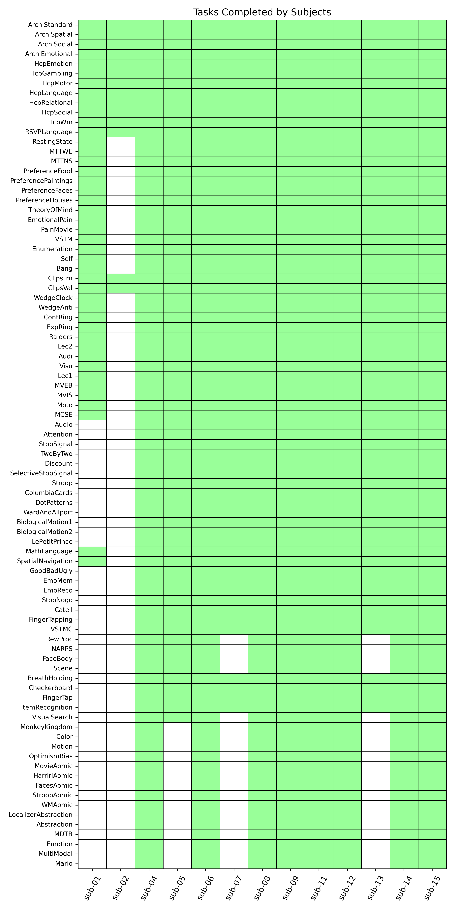

Participants
============

The cohort of the IBC dataset consists in a permanent group of twelve
adults with neither psychiatric and neurologic disorders nor specific
psychometric profile. Participants are numbered from 1 to 15, by which
participants 3 and 10 are not part of the group.

`This table <demographics_>`__ contains demographic information of
the participants. Data from *sub-02* were only acquired for the ARCHI
tasks, HCP tasks plus RSVP Language task and, thus, the cohort is
exceptionally composed of thirteen participants for these particular
tasks. For further details about exclusion criteria and experimental
procedures concerned with the handling of the participants, please
consult (Pinho et al. 2018).

.. _demographics:

.. table:: Demographic data of the participants. Age is participant age at the time of recruitment.

   ========== =================== ==== === ================
   Subject ID Year of recruitment Age  Sex Handedness score
   ========== =================== ==== === ================
   *sub-01*   2015                39.5 M   0.3
   *sub-02*   2015                32.8 M   1
   *sub-04*   2015                26.9 M   0.8
   *sub-05*   2015                27.4 M   0.6
   *sub-06*   2015                33.1 M   0.7
   *sub-07*   2015                38.8 M   1
   *sub-08*   2015                36.5 F   1
   *sub-09*   2015                38.5 F   1
   *sub-11*   2016                35.8 M   1
   *sub-12*   2016                40.8 M   1
   *sub-13*   2016                28.2 M   0.6
   *sub-14*   2016                28.3 M   0.7
   *sub-15*   2017                30.3 M   0.9
   ========== =================== ==== === ================

Tasks performed by each participant
-----------------------------------

The figure below illustrates the tasks completed by each participant, highlighting the variation in task participation across individuals. While some participants completed all tasks, others only performed a subset of them.

.. _tasksubdiagram:

   **Tasks performed by each participant.** Each row corresponds to a different task, and each column represents a participant. Cells are highlighted in green if the participant completed the task; otherwise, the cell remains uncolored.